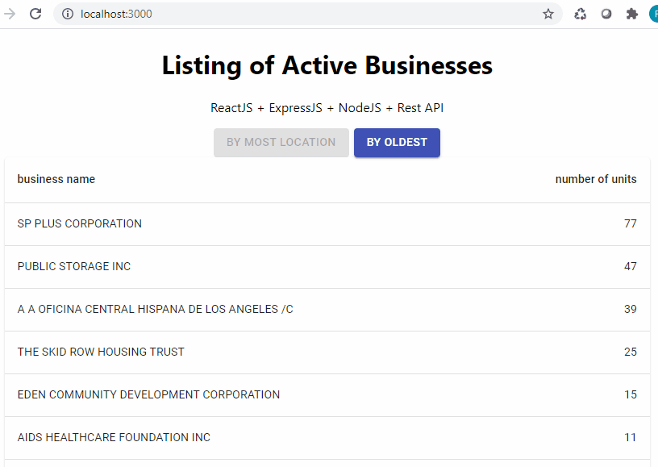

# Active Businesses

Frontend: ReactJS, MATERIAL-UI components

Backend: NodeJS, ExpressJS, Rest API

Data resource: https://data.lacity.org/resource/6rrh-rzua.json





## Getting Started

step 1: Install NodeJS

[NodeJS]: https://nodejs.org/en/download/

step 2: Install Git

[Git]: https://git-scm.com/book/en/v2/Getting-Started-Installing-Git

step 3: by Terminal/CMD, choose the local directory where to work

step 4:  by Terminal/CMD, clone the repository to your machine

```
git clone https://github.com/RogerRocco/active-businesses.git
```

step 4: using two Terminal/CMD

one to run the backend directory (Web Server)

```
node index.js
```

and another to run the frontend (React App)

```
npm start
```

That's it! It should be running at http://localhost:3000/